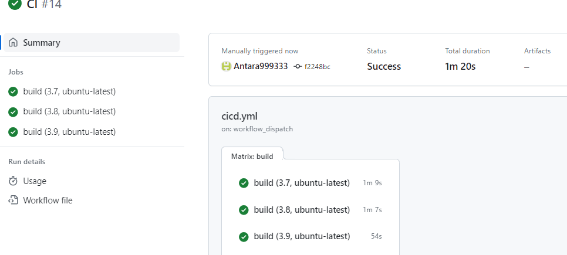

# This is my Individual Project 1. 
I have created a lib.py file which provides code to both, an ipynb file and a .py file to return descriptive statistics for a data set. 

## Jupyter Notebook :

This notebook contains cells that perform descriptive statistics using the Pandas library. It has been validated using the nbval plugin for pytest.

## Python Script :

This script executes the same descriptive statistics using Pandas as the Jupyter notebook.

## Library:

The lib.py file holds shared code that is used by both the Python script and the Jupyter notebook. This allows for code reusability and maintainability.

## Makefile:

The Makefile contains four commands that are executed by GitHub Workflows on each push and pull request:

Test: This command runs all tests, including those for the notebook, script, and library.
Format: It formats the code using Python black, ensuring consistent code style.
Lint: This command lints the code using Ruff to identify and address any code quality issues.
OnInstall: It installs project dependencies by running pip install -r requirements.txt.

## The requirements.txt file:
 This specifies exact versions of project dependencies to ensure consistency and reproducibility.

